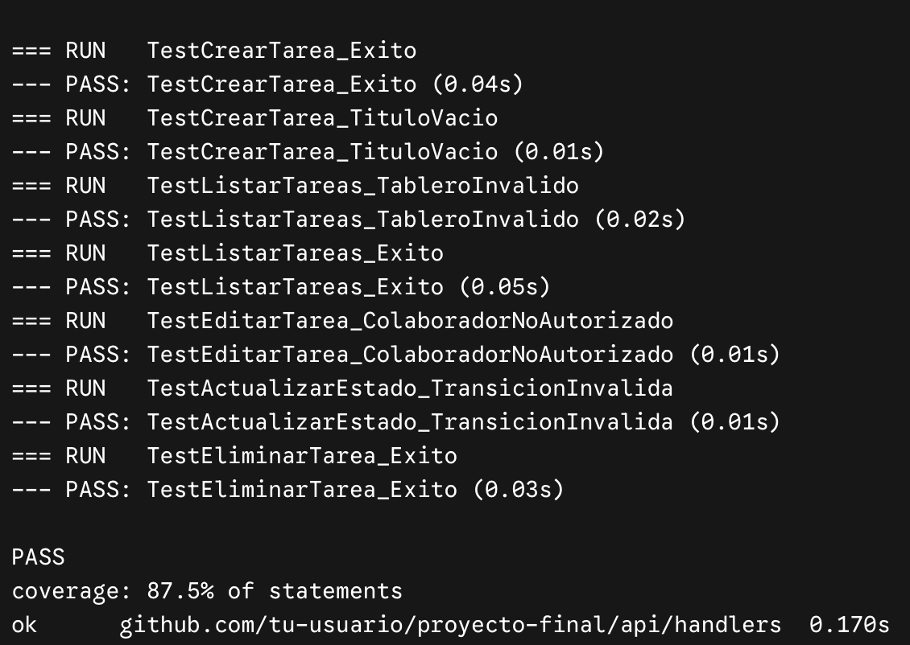
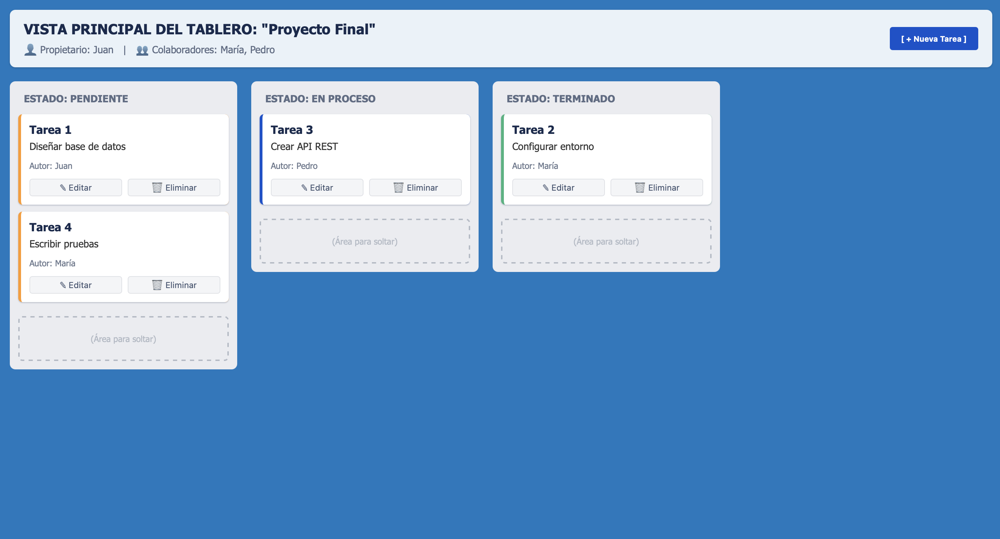
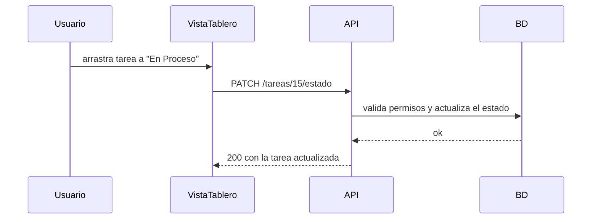
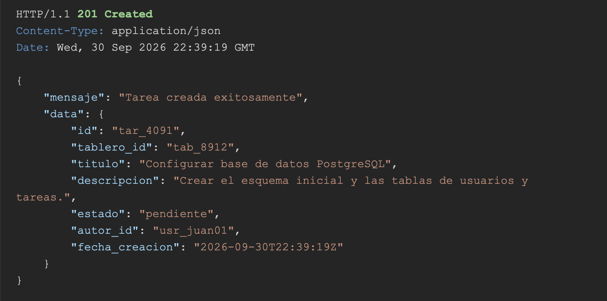
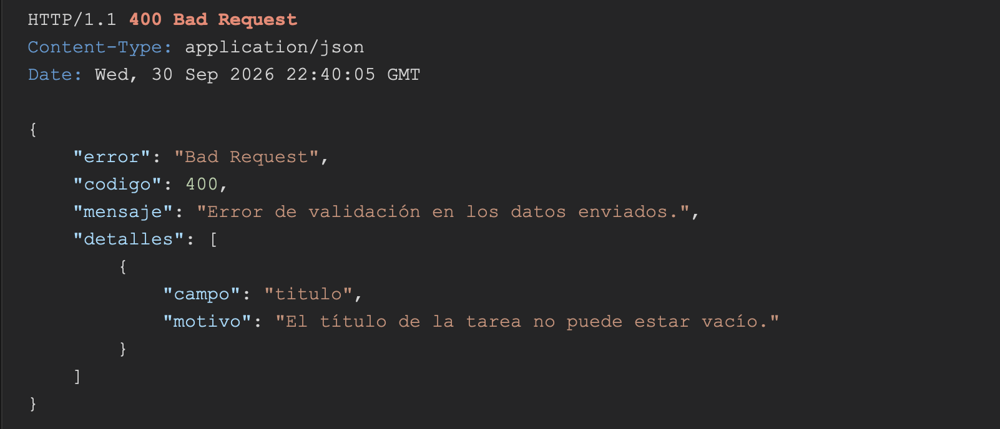

# Hito 1 · Addendum técnico

**Pareja:** Maholy García · Brittany García
**Paralelo:** A

## A. Estructura del proyecto

```text
Notix-Backend/
├── cmd/
│ └── api/
│ └── main.go # Punto de entrada principal: arranca el servidor HTTP y carga variables de entorno.
├── config/
│ └── database.go # Configuración y conexión inicial a la base de datos con GORM.
├── internal/
│ ├── handlers/
│ │ ├── usuario_handler.go # Manejadores HTTP: autenticación, registro y gestión de usuarios.
│ │ ├── tablero_handler.go # Manejadores HTTP: creación, actualización y listado de tableros.
│ │ ├── columna_handler.go # Manejadores HTTP: creación, ordenamiento y eliminación de columnas Kanban.
│ │ ├── tarea_handler.go # Manejadores HTTP: CRUD de tareas y transiciones de la máquina de estados.
│ │ ├── compartido_handler.go # Manejadores HTTP: gestión de colaboradores y permisos compartidos en tableros.
│ │ └── comentario_handler.go # Manejadores HTTP: creación, lectura y eliminación de comentarios en tareas.
│ ├── middlewares/
│ │ └── auth_middleware.go # Interceptores para validar tokens JWT, sesiones y roles de usuario.
│ ├── models/
│ │ └── models.go # Definición de las structs en Go para las 6 entidades con etiquetas GORM y JSON.
│ ├── repository/
│ │ └── tarea_repository.go # Capa de acceso a datos: consultas SQL/GORM directas sobre la base de datos.
│ └── services/
│ └── tarea_service.go # Capa de lógica de negocio: validación de estados, RBAC y reglas de negocio Kanban.
├── docs/
│ ├── hito1_ficha_del_negocio.md # Documento formal de la Ficha del Negocio para el Hito 1.
│ ├── hito1_addendum.md # Anexo documental con especificaciones y diagramas adicionales.
├── .env # Archivo local con variables de entorno y credenciales reales (ignorado en Git).
├── .env.example # Plantilla de ejemplo de variables de entorno sin datos sensibles para el repositorio.
├── go.mod # Archivo de definición de módulos y dependencias de Go.
├── go.sum # Registro de sumas de verificación de seguridad para dependencias de Go.
└── README.md # Guía de instalación, ejecución local y documentación general del proyecto.
```

## B. Configuración y secretos

| Variable    | Para qué sirve                                   | Ejemplo (sin datos reales) |
| ----------- | ------------------------------------------------ | -------------------------- |
| Puerto      | Puerto en el que se ejecuta el servidor HTTP     | 8080                       |
| DB_HOST     | Host del servidor de la base de datos PostgreSQL | localhost                  |
| DB_PORT     | Puerto de conexión a PostgreSQL                  | 5432                       |
| DB_USER     | Usuario de la base de datos utilizado por GORM   | notix                      |
| DB_PASSWORD | Contraseña para autenticar con PostgreSQL        | @qlslsl@                   |
| DB_NAME     | Nombre de la base de datos de Notix              | DB_notix                   |

**Archivo de ejemplo:** .env.example

## C. Pruebas

<!-- Cuántas pruebas tienen y qué caso cubre cada una. Después, la captura de la corrida. -->

| Prueba | Qué caso cubre |
| **TestCrearTarea_Exito** | Evalúa `POST /tareas`. Verifica que un propietario o colaborador pueda registrar una tarea y que esta devuelva el estado inicial "pendiente".|
| **TestCrearTarea_TituloVacio** | Evalúa `POST /tareas`. Comprueba la validación del sistema asegurando que devuelva error si el título de la tarea está vacío.|
| **TestListarTareas_TableroInvalido** | Evalúa `GET /tableros/[id]/tareas`. Valida que el endpoint devuelva un error adecuado si se intenta consultar un tablero que no existe.|
| **TestListarTareas_Exito** | Evalúa `GET /tableros/[id]/tareas`. Confirma que la vista principal reciba correctamente la lista de tareas si el tablero existe y el usuario tiene acceso.|
| **TestEditarTarea_ColaboradorNoAutorizado** | Evalúa `PATCH /tareas/[id]`. Asegura que la API bloquee la acción si un colaborador intenta editar el título o contenido de una tarea de la cual no es autor.|
| **TestActualizarEstado_TransicionInvalida** | Evalúa `PATCH /tareas/[id]/estado`. Verifica que el sistema rechace el cambio si se intenta una transición de estado que no es válida para la regla de negocio.|
| **TestEliminarTarea_Exito** | Evalúa `DELETE /tareas/[id]`. Comprueba que un usuario con los permisos correctos (autor o propietario) pueda borrar la tarea y reciba un mensaje de confirmación.|

**Captura de `go test ./...`:** 

## D. Boceto de la pantalla principal

<!-- La pantalla que consume el endpoint de listado. A mano y fotografiada, o en cualquier herramienta.
     Tiene que verse qué campos muestra y dónde aparece el estado. -->



## E. Diagrama de secuencia del caso de uso principal



## F. Capturas de respuestas

<!-- Dos capturas: una petición que sale bien y una que falla la validación. Que se vea el código. -->

**Caso correcto:** 

**Caso con error de validación:** 
