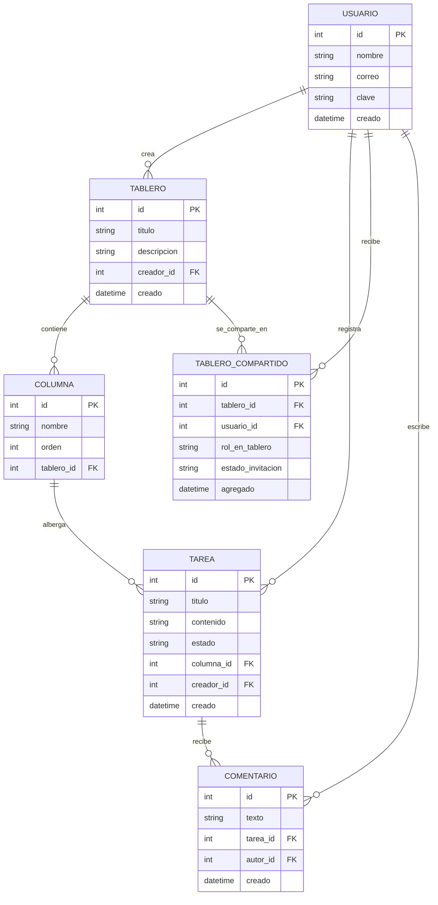
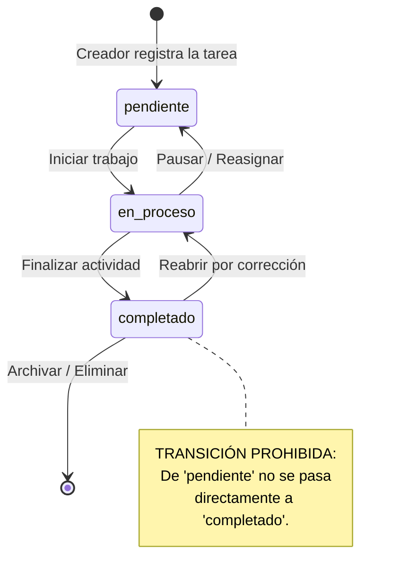

# Hito 1 · Ficha del negocio

**Pareja:** Maholy García · Brittany García
**Paralelo:** Aplicación para el Servidor Web A
**Negocio en una línea:** Notix plataforma web de notas visuales organizadas en tableros Kanban, dirigida a estudiantes, trabajadores y pequeños equipos.

## 1. Negocio de referencia

<!-- Caso de Starter Story: qué vende, a quién, cómo cobra y qué cifras declara el fundador. 120 a 200 palabras. -->

**Enlace:** (video o artículo)

## 2. Caso de contraste

<!-- Un negocio comparable que fracasó o se estancó, y su hipótesis sobre por qué. La hipótesis señala una diferencia de fondo (modelo de cobro, costos, mercado), no una anécdota. 100 a 180 palabras. -->

**Fuente:** (enlace)

## 3. Adaptación al Ecuador

<!-- Al menos tres restricciones concretas. Cada una dice qué pasa, dónde y qué efecto tiene. -->

1. Cuando un usuario comparte una nota o tablero con otra persona usando su correo, si el servidor no verifica correctamente los permisos en cada petición, la persona invitada podría terminar viendo otros tableros privados del creador. Esto sucede en el backend durante la consulta de notas y provoca la filtración de información privada o académica entre los mismos usuarios del sistema.
2. Al registrar a las personas con su nombre y correo electrónico dentro de la plataforma, si no se maneja la privacidad adecuadamente, cualquier usuario podría averiguar la lista completa de correos registrados intentando compartir un tablero. Esto ocurre en la pantalla de "Compartir Tablero" y provoca que se expongan datos personales de los usuarios a personas desconocidas dentro del sistema.
3.

**Qué cambió en el modelo por estas restricciones:**
Por las restricciones sobre la privacidad de usuarios (Restricción 1) y el control de accesos al consultar tableros (Restricción 2), se modificó el modelo agregando la entidad TableroCompartido con un atributo de permiso (RolEnTablero) y el estado de la vinculación (activo o pendiente)

## 4. Modelo de datos

### Entidad: Usuario

| Atributo | Tipo          | Obligatorio | Ejemplo          |
| -------- | ------------- | ----------- | ---------------- |
| id       | número entero | sí          | 1                |
| nombre   | texto         | sí          | Maria Intriago   |
| correo   | texto         | sí          | mariai@gmail.com |
| clave    | texto         | sí          | loc@sthebest5    |
| creado   | fecha y hora  | sí          | 28-09-2026 14:00 |

### Entidad: Tablero

| Atributo    | Tipo                 | Obligatorio | Ejemplo          |
| ----------- | -------------------- | ----------- | ---------------- |
| id          | número entero        | sí          | 5                |
| titulo      | texto                | sí          | Proyect App      |
| descripcion | texto                | sí          | App de ATM       |
| creador_id  | referencia a Usuario | sí          | 1                |
| creado      | fecha y hora         | sí          | 28-09-2026 14:30 |

### Entidad: Columna

| Atributo   | Tipo                 | Obligatorio | Ejemplo   |
| ---------- | -------------------- | ----------- | --------- |
| id         | número entero        | sí          | 2         |
| tablero_id | referencia a Tablero | sí          | 12        |
| nombre     | texto                | sí          | Por Hacer |
| orden      | número entero        | sí          | 1         |

### Entidad: Tarea

| Atributo   | Tipo                                      | Obligatorio | Ejemplo            |
| ---------- | ----------------------------------------- | ----------- | ------------------ |
| id         | número entero                             | sí          | 2                  |
| columna_id | referencia a Columna                      | sí          | 201                |
| usuario_id | referencia a Usuario                      | sí          | 2                  |
| titulo     | texto                                     | sí          | Botón CSV          |
| contenido  | número entero                             | no          | Diseñar y exportar |
| estado     | uno de: pendiente, en_proceso, completado | sí          | pendiente          |
| creado     | fecha y hora                              | sí          | 28-09-2026 15:30   |

### Entidad: TableroCompartido

| Atributo          | Tipo                                | Obligatorio | Ejemplo          |
| ----------------- | ----------------------------------- | ----------- | ---------------- |
| id                | número entero                       | sí          | 5                |
| tablero_id        | referencia a Tablero                | sí          | 12               |
| usuario_id        | referencia a Usuario                | sí          | 2                |
| rol_en_tablero    | uno de: propietario, colaborador    | sí          | colaborador      |
| estado_invitacion | uno de: pendiente, activo, revocado | sí          | activo           |
| agregado          | fecha y hora                        | sí          | 28-09-2026 14:40 |

### Entidad: Comentario

| Atributo | Tipo                 | Obligatorio | Ejemplo          |
| -------- | -------------------- | ----------- | ---------------- |
| id       | número entero        | sí          | 200              |
| texto    | texto                | sí          | Subí cambios     |
| tarea_id | referencia a Tarea   | sí          | 501              |
| autor_id | referencia a Usuario | sí          | 2                |
| creado   | fecha y hora         | sí          | 28-09-2026 15:10 |

### Relaciones

| Entidades                   | Cardinalidad | Frase                                                                                                         |
| --------------------------- | ------------ | ------------------------------------------------------------------------------------------------------------- |
| Usuario — Tablero           | 1 — N        | Un usuario puede crear varios tableros; un tablero pertenece a un solo usuario                                |
| Tablero — Columna           | 1 — N        | Un tablero contiene muchas columnas; cada columna pertenece a un solo tablero.                                |
| Columna — Tarea             | 1 — N        | Una columna contiene muchas tareas; cada tarea está ubicada en una sola columna.                              |
| Usuario — Tarea             | 1 — N        | Un usuario puede crear muchas tareas; cada tarea es creada por un solo usuario.                               |
| Tablero — TableroCompartido | 1 — N        | Un tablero se puede compartir con muchos usuarios; cada registro de compartición pertenece a un solo tablero. |
| Usuario — TableroCompartido | 1 - N        | Un usuario puede ser invitado a muchos tableros; cada registro vincula a un solo usuario.                     |
| Tarea — Comentario          | 1 — N        | Una tarea puede recibir muchos comentarios; cada comentario pertenece a una sola tarea.                       |
| Usuario — Comentario        | 1 — N        | Un usuario puede escribir muchos comentarios; cada comentario es redactado por un solo autor.                 |

### Structs en Go

```go
type Usuario struct {
	ID     uint      `gorm:"primaryKey" json:"id"`
	Nombre string    `gorm:"not null" json:"nombre"`
	Correo string    `gorm:"uniqueIndex;not null" json:"correo"`
	Clave  string    `gorm:"not null" json:"-"`
	Creado time.Time `gorm:"autoCreateTime" json:"creado"`
}

type Tablero struct {
	ID          uint      `gorm:"primaryKey" json:"id"`
	Titulo      string    `gorm:"not null" json:"titulo"`
	Descripcion string    `json:"descripcion"`
	CreadorID   uint      `gorm:"not null" json:"creador_id"`
	Creador     Usuario   `gorm:"foreignKey:CreadorID" json:"creador,omitempty"`
	Creado      time.Time `gorm:"autoCreateTime" json:"creado"`
}

type Columna struct {
	ID        uint    `gorm:"primaryKey" json:"id"`
	Nombre    string  `gorm:"not null" json:"nombre"`
	Orden     int     `gorm:"not null" json:"orden"`
	TableroID uint    `gorm:"not null" json:"tablero_id"`
	Tablero   Tablero `gorm:"foreignKey:TableroID" json:"-"`
}

type Tarea struct {
	ID        uint      `gorm:"primaryKey" json:"id"`
	Titulo    string    `gorm:"not null" json:"titulo"`
	Contenido string    `json:"contenido"`
	Estado    string    `gorm:"type:varchar(20);not null;default:'pendiente'" json:"estado"`
	ColumnaID uint      `gorm:"not null" json:"columna_id"`
	Columna   Columna   `gorm:"foreignKey:ColumnaID" json:"columna,omitempty"`
	CreadorID uint      `gorm:"not null" json:"creador_id"`
	Creador   Usuario   `gorm:"foreignKey:CreadorID" json:"creador,omitempty"`
	Creado    time.Time `gorm:"autoCreateTime" json:"creado"`
}

type TableroCompartido struct {
	ID               uint      `gorm:"primaryKey" json:"id"`
	TableroID        uint      `gorm:"not null" json:"tablero_id"`
	Tablero          Tablero   `gorm:"foreignKey:TableroID" json:"tablero,omitempty"`
	UsuarioID        uint      `gorm:"not null" json:"usuario_id"`
	Usuario          Usuario   `gorm:"foreignKey:UsuarioID" json:"usuario,omitempty"`
	RolEnTablero     string    `gorm:"type:varchar(20);not null;default:'colaborador'" json:"rol_en_tablero"`
	EstadoInvitacion string    `gorm:"type:varchar(20);not null;default:'pendiente'" json:"estado_invitacion"`
	Agregado         time.Time `gorm:"autoCreateTime" json:"agregado"`
}


type Comentario struct {
	ID      uint      `gorm:"primaryKey" json:"id"`
	Texto   string    `gorm:"not null" json:"texto"`
	TareaID uint      `gorm:"not null" json:"tarea_id"`
	Tarea   Tarea     `gorm:"foreignKey:TareaID" json:"-"`
	AutorID uint      `gorm:"not null" json:"autor_id"`
	Autor   Usuario   `gorm:"foreignKey:AutorID" json:"autor,omitempty"`
	Creado  time.Time `gorm:"autoCreateTime" json:"creado"`
}
```

**Decisión de tipos que tuvimos que pensar:**
Se eligió el tipo time.Time en lugar de texto o string para manejar las fechas (Creado y Agregado), aprovechando la opción gorm:"autoCreateTime" para que la base de datos le asigne la marca de tiempo de forma automática al guardar cada registro. Además, se le puso la regla json:"-" a la contraseña del Usuario para evitar que la clave encriptada se envíe por error en las respuestas JSON hacia la pantalla.

### Diagrama del modelo completo



**Decisión discutible del modelo y por qué la tomamos:**
Decisión: Mantener TableroCompartido como una entidad independiente intermedia en lugar de almacenar una lista de correos o IDs de usuarios en un campo de texto dentro del Tablero.  
Razón: Para manejar la colaboración de forma segura, necesitamos guardar permisos específicos para cada persona (si es propietario o colaborador) y el estado en el que está su acceso (si la invitación está pendiente, activa o fue revocada). Manejarlo en una tabla aparte le permite al backend revisar los permisos en cada petición, quitar accesos de forma limpia y evitar que se filtren o se vean tableros privados sin autorización.

## 5. Máquina de estados

**Entidad con estados:**

| Estado              | Qué significa                                                                                            |
| ------------------- | -------------------------------------------------------------------------------------------------------- |
| pendiente (inicial) | La tarea/nota ha sido creada y registrada en el tablero, pero aún no se ha comenzado a trabajar en ella. |
| en_proceso          | Un miembro del equipo está trabajando en la tarea en este momento.                                       |
| completado          | La tarea ha finalizado con éxito y cumple con los requerimientos establecidos.                           |

| De         | A          | Quién la hace             | Condición                                                        |
| ---------- | ---------- | ------------------------- | ---------------------------------------------------------------- |
| pendiente  | en_proceso | Propietario o Colaborador | Iniciar la ejecución de la tarea asignada.                       |
| en_proceso | pendiente  | Propietario o Colaborador | Pausar la actividad o reasignar el trabajo a otra persona.       |
| en_proceso | completado | Propietario o Colaborador | Confirmar la finalización total del contenido de la tarea.       |
| completado | en_proceso | Propietario o Colaborador | Reabrir la tarea por correcciones, cambios o revisión requerida. |

**Transición prohibida y por qué:**
De pendiente no se puede pasar directamente a completado.
Razón: En la metodología Kanban, una tarea no puede considerarse finalizada sin haber pasado obligatoriamente por la fase de ejecución (en_proceso). Si se permitiera saltar directo a completado, se falsearía el historial de trabajo, se perdería la trazabilidad de quién ejecutó la tarea y se alterarían las métricas reales del tiempo de ciclo del equipo dentro del tablero.

### Diagrama de estados



## 6. Roles y permisos

| Acción                                    | Propietario | Colaborador    |
| ----------------------------------------- | ----------- | -------------- |
| Crear o eliminar el tablero               | sí          | No             |
| Editar título o descripción del tablero   | sí          | No             |
| Invitar o revocar acceso a otros usuarios | sí          | No             |
| Crear o eliminar columnas                 | sí          | No             |
| Reordenar columnas del tablero            | sí          | No             |
| Crear tareas en cualquier columna         | sí          | sí             |
| Ver tareas del tablero                    | todos       | todos          |
| Editar título o contenido de una tarea    | todos       | solo los suyos |
| Mover tarea de columna / cambiar estado   | todos       | solo los suyos |
| Eliminar una tarea                        | todos       | solo los suyos |

## 7. Mapa de endpoints por rol

| Endpoint                  | Rol que lo llama         | Pantalla que lo consume     | Qué devuelve                      | Qué valida                                                                | Código si falla |
| ------------------------- | ------------------------ | --------------------------- | --------------------------------- | ------------------------------------------------------------------------- | --------------- |
| POST /tareas              | propietario, colaborador | Ventana Nueva Tarea         | Tarea creada con estado pendiente | Que el título no esté vacío y el usuario pertenezca al tablero            | 422             |
| GET /tableros/[id]/tareas | propietario, colaborador | Vista principal del Tablero | Lista de tareas del tablero       | Que el tablero exista y el usuario tenga acceso                           | 404             |
| PATCH /tareas/[id]        | propietario,colaborador  | Ventana Editar Tarea        | Tarea actualizada                 | Si es colaborador, que la tarea sea suya; si es propietario, acceso libre | 403             |
| PATCH /tareas/[id]/estado | propietario, colaborador | Vista principal del Tablero | Tarea con el nuevo estado         | Transición válida de la máquina de estados                                | 409             |
| DELETE /tareas/[id]       | propietario colaborador  | Botón Eliminar Tarea        | Mensaje de confirmación           | Que el usuario sea el autor de la tarea o el propietario del tablero      | 403             |

### Matriz pantalla × endpoint

| Pantalla                    | POST /tareas | GET /tableros/[id]/tareas | PATCH /tareas/[id] | PATCH /tareas/[id]/estado | DELETE /tareas/[id] |
| --------------------------- | ------------ | ------------------------- | ------------------ | ------------------------- | ------------------- |
| Vista principal del Tablero |              | X                         |                    | X                         |                     |
| Ventana Nueva Tarea         | X            |                           |                    |                           |                     |
| Ventana Editar Tarea        |              |                           | X                  |                           |                     |
| Botón Eliminar Tarea        |              |                           |                    |                           | X                   |

**Endpoints que ya están funcionando y en qué archivo:**
No existen por el momento endpoints que esten fucionando actualmente en nuestro sistema, se están estableciendo las ideas e implementaciones futuras.
Pero estas serían la rutas que hemos establecido:

```text
POST /tareas -> internal/handlers/tarea_handler.go (CrearTareaHandler)
GET /tableros/[id]/tareas -> internal/handlers/tarea_handler.go (ObtenerTareasPorTableroHandler)
PATCH /tareas/[id] -> internal/handlers/tarea_handler.go (ActualizarTareaHandler)
PATCH /tareas/[id]/estado -> internal/handlers/tarea_handler.go (CambiarEstadoTareaHandler)
DELETE /tareas/[id] -> internal/handlers/tarea_handler.go (EliminarTareaHandler)
```

## 8. Declaración de IA

IA: Gemini, secciones 4, 6, 7, A
